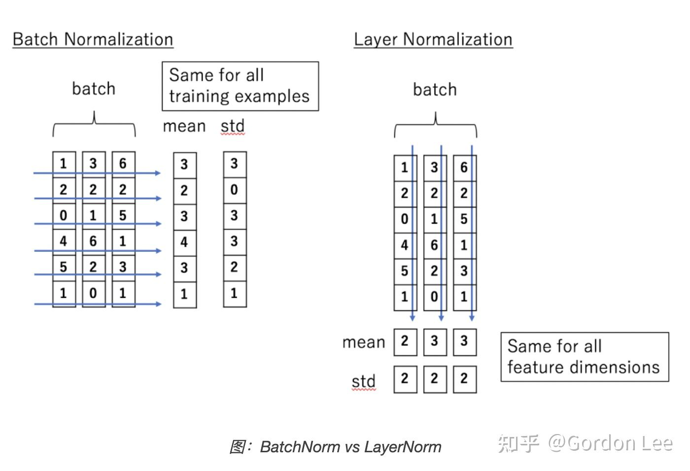

## Tutorials
收集优秀的Jupyter notebook about BERT and Transformer

## torch tutorial
torchtext主要分为3部分: Field，Dataset，Iteration
### Field
```python
def tokenizer(x): return jieba.lcut(x)
sentence_field = Field(
    sequential=True,
    tokenize=tokenizer,
    lower=False,
    batch_first=True,
    include_lengths=True
)
label_field = Field(sequential=False, use_vocab=False)
```
Field类可以用张量Tensor表示常见的文本处理数据。 其包含一个Vocab词表对象，该对象对Field中的文本数据及其向量化表示进行定义。
- squential: 数据是否为序列数据，默认为True。如果为False，则不能使用分词  
- use_vocab: 是否使用字典，默认为True。如果为False， 那么输入的数据类型必须是树枝类型。  
- init_token: 文本的起始字符，默认为None  
- eos_token: 文本的结束字符，默认为None  
- tokenizer: 用于进行分词的具体方法，默认为Python标准的字符串对象分割函数split()。也可以进行特殊指定，如 `tokenize="spacy"`
- stop_words: 预处理过程中丢弃的词
- preprocessing/postprocessing: 指名该Field对象数据在数值化前，后进行的流水线处理。默认均为None
- build_vocab(): 通过训练数据构建词表，并通过 max_size指定其中词频最大的茜1000个词纳入考虑。  
这里vectors=Glove()表示预训练好的词向量进行初始化。注意这里仅仅是将预训练的词向量进行初始化，
并未模型中实际使用该预训练词向量，如果不使用下面的语句将 glove.6b.300d 等预训练词向量倒入，
则词向量通常会由网络中Embedding层负责训练。
```python
TEXT.build_vocab(train,
                 vectors = GloVe(name = '6B',dim = 300),
                 max_size = 10000,
                 min_freq = 10)

LABEL.build_vocab(train)
```

```python
model.embedding.weight.data = TEXT.vocab.vectors
model.embedding.weight.requires_grad = False
```
### Dataset
这里我们需要做的一般是继承 `torchtext.data.Dataset`， 然后重写自己的Dataset。写Dataset时，
最主要的是Example和Field的结合
```python
from torchtext.data import Dataset, Example

class SentenceDataset(Dataset):
    def __int__(self, data_path, sentence_field, label_field):
        fields = [("sentence",sentence_field),("label",label_field)]
        examples = []
        with open(data_path, "r") as f_json:
            file_content = json.load(f_json)
            self.sentence_list = []
            self.label_list = []
            for data in file_content:
                self.sentence_list.append(data['sentence'])
                self.label_list.append(data['label'])
                
        for index in range(len(self.sentence_list)):
            examples.append(Example.fromlist([self.sentence_list[index], self.label_list[index]], fields))

        super().__init__(examples, fields)
        
    @staticmethod
    def sort_key(input):
        return len(input.sentence)
```
这里将输入的文本，标签和Field进行绑定，也就是告诉Field它具体处理哪些东西，然后使用 `super().__init__(examples,fields)`
来调用父类的初始化。这里还有一个 `def sort_key(input)`，这个方法帮助后面的iteration进行数据排序用的关键词，
其实在Iteration中可以直接设置用于排序的关键词，但是因为在Field里面使用类 `include_lengths` 关键词，
导致后面的iteration直接指定关键词无法进行正常的排序。  
对于上面的example和Field进行绑定时，这里使用的训练数据是由标签的，所以标签位置就直接写，若数据无标签:
```python
examples.append(Example.fromlist([self.sentence_list[index],None],fields))
```

### Iterator
```python
train_iterator = BucketIterator(
    train_dataset,
    batch_size=batch_size,
    device="cuda",
    sort_within_batch=True,
    shuffle=True
)
test_iterator = Iterator(
    test_dataset,
    batch_size=batch_size,
    device="cuda",
    sort=False,
    shuffle=True
)
```
这里使用了 `BucketIterator, Iterator`, 因为BucketIterator可以自动选择长度类似的文本组成一个batch，
所以用于训练数据，而测试数据一般不需要该操作。

## NN
### Embedding

```python
torch.nn.Embedding(num_embeddings, embedding_dim, padding_idx=None,
 max_norm=None,  norm_type=2.0,   scale_grad_by_freq=False, 
 sparse=False,  _weight=None)
```
> 简单的存储固定大小的词典的嵌入向量的查找表示。 输入为一个编号列表， 输出为对应符号的嵌入向量

### Layer Norm
在训练时， 对BN来说需要保持每个step的统计信息(均值和方差)。 在测试时， 由于变长句子的特性， 测试集可能出现比训练集更长的橘子， 
所以对后面位置的step， 是没有训练的统计量使用的。

BN是对batch的纬度去做归一化， 也就是针对不同样本的特征做操作。 LN是对hidden的纬度去做归一化， 也就是针对单个样本的不同特征做操作。 因此LN可以不受样本数的限制。

```python
import torch


class LayerNorm(nn.Module):
    def __init__(self, features, eps=1e-6):
        super(LayerNorm, self).__init__()
        self.a_2 = nn.Parameter(torch.ones(features))
        self.b_2 = nn.Parameter(torch.zeros(features))
        self.eps = eps
    
    def forward(self, x):
        # 统计每个样本所有纬度的值， 求均值和方差，所以就是在hidden dim上操作
        # 相当于变成[bsz*max_len， hidden_dim]
        mean = x.mean(-1, keepdim=True)
        std = x.std(-1, keepdim=True)
        # 注: 这里也是在最后一个纬度发生广播
        return self.a_2*(x-mean)/(std+self.eps) + self.b_2
```

https://github.com/BritneyMuller/colab-notebooks/blob/master/BERT.ipynb